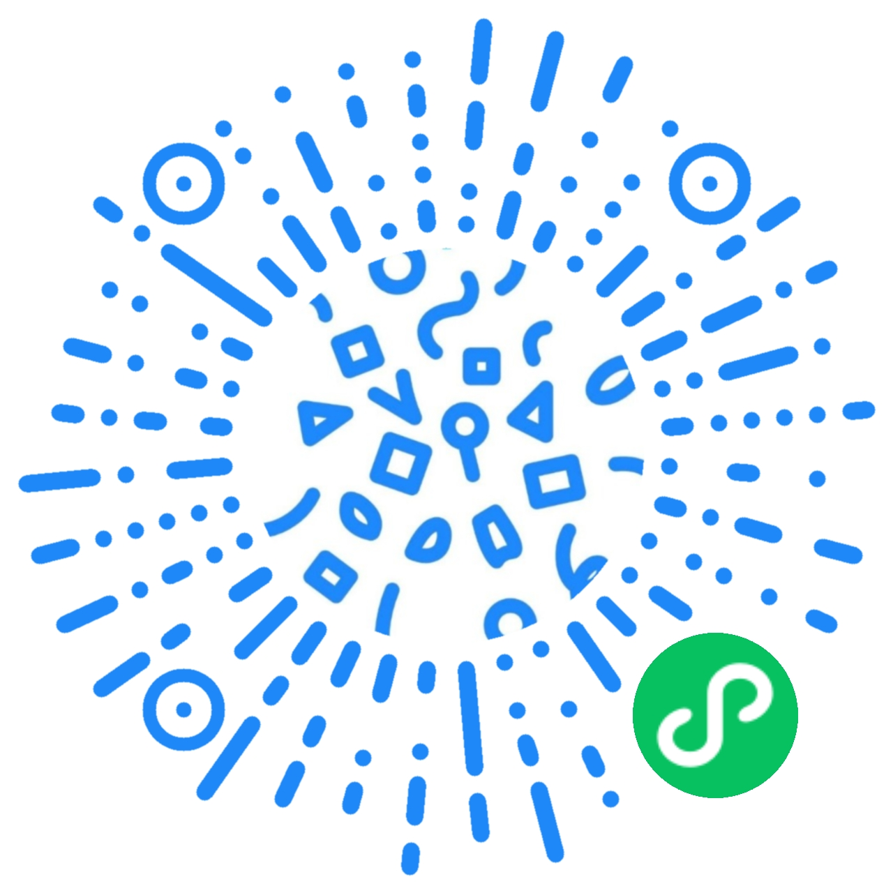

# 欢迎！ :wave:

最后更新于：2025-08-05

手机版可点击左上角四条小杠即可查看更多。

我们正在开展信息收集活动，欢迎关注并支持我们～

!!! warning "催更须知"
    催更前请先确认你已经贡献了新的评价，否则我也没有任何内容可以用来更新，不要白嫖！不要白嫖！不要白嫖！

- **催更**：[https://wj.qq.com/s2/15037562/8877/](https://wj.qq.com/s2/15037562/8877/)
- **贡献新的评价**：[https://wj.qq.com/s2/8669157/afbb/](https://wj.qq.com/s2/8669157/afbb/)

**考试座位信息表（开考前一小时更新）**

<iframe id="exam-iframe" style="border: 1px solid #000; transition: height 0.3s ease;" src="https://apps.hksyu.edu/examtmtbl/" name="HKSYU 考试时间表" width="100%" height="300" scrolling="auto"></iframe>
<button onclick="(function(){var f=document.getElementById('exam-iframe');var b=document.getElementById('exam-btn');if(f.height==300){f.height=600;b.textContent='收起';}else{f.height=300;b.textContent='展开更多';}})()" id="exam-btn" style="display:block;margin:8px auto 0;padding:6px 20px;border:1px solid var(--gb-card-border,#e0e0e0);border-radius:4px;background:var(--gb-card-bg,#f8f8f8);color:var(--gb-content-text,#333);cursor:pointer;font-size:13px;">展开更多</button>

## 近期更新

- **SOC233**: [Contemporary Social Issues](soc/soc233.md)

## 小程序版本

---

## 一些 Q&A

**Q: 这个平台是干什么的？**

A: 这个平台收集了来自香港树仁大学同学们的对于课程的评价以及看法，以帮助别的同学在选课的时候有一定的参考。

**Q: 收费么？**

A: 不收费，因为内容来自学校的各位同学，所以我们承诺永不收费，平台运营费用将由我们自行承担。

**Q: 怎么用？**

A: 我们有小程序和网页版，大家可以自行选择，选中课程后，点进即可查看评分。每条共有三部分内容：

1. 基本信息
2. 综合信息
3. 评价

其中，基本信息来自 Websims 以及同学提供，综合信息由评价信息中的内容提供。

**Q: 怎么提交评价？**

A: 点击链接前往：[https://wj.qq.com/s2/8669157/afbb/](https://wj.qq.com/s2/8669157/afbb/)

或使用微信扫描上方二维码。

**Q: 评价是 AI 生成的么？**

A: 不确定，我们不主动生成虚假的 AI 信息，除非评价的提交者使用 AI 撰写了评价。不过如果我们发现，会特别注明。
